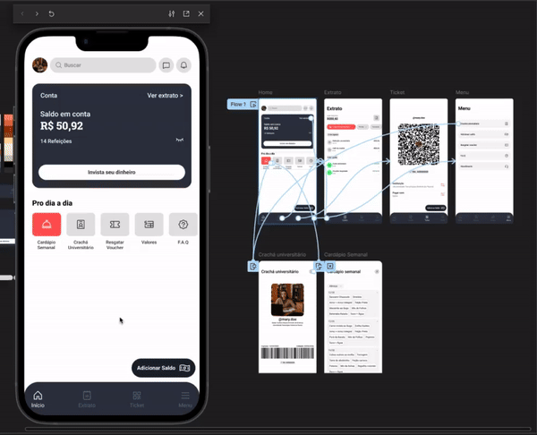
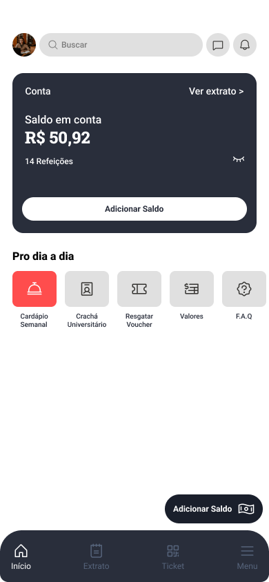
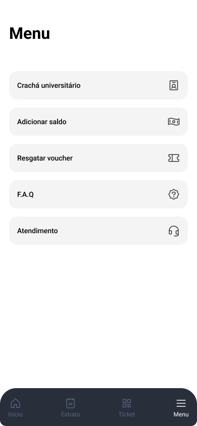
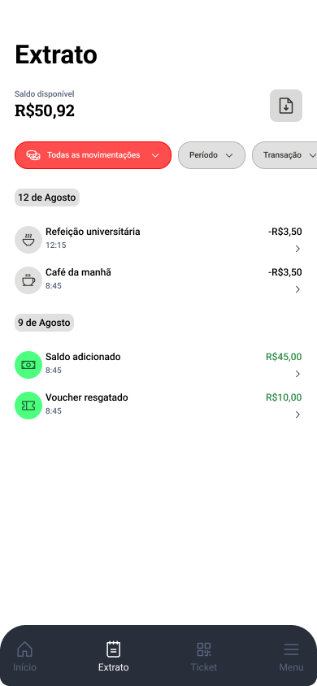
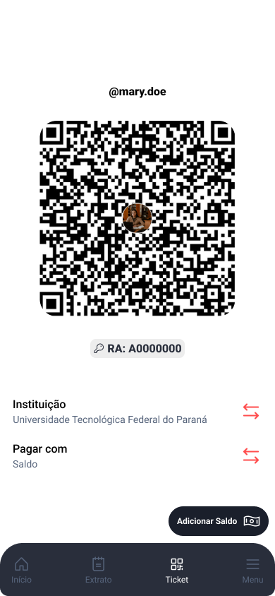
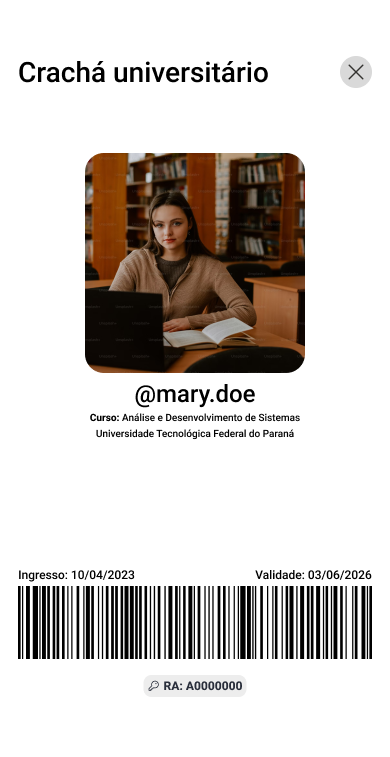

## Prototipação

- A versão completa do protótipo pode ser testada em: [Papei Protótipo 📱](https://www.figma.com/proto/ppnmrdaS6OdGyS6AgajidL/PaPei?node-id=0-1&t=QS3DCQMDFFO0wqO6-1) 
- Acesso ao projeto do Figma: [Papei Figma 📂](https://www.figma.com/design/ppnmrdaS6OdGyS6AgajidL/PaPei?node-id=0-1&t=QS3DCQMDFFO0wqO6-1)

--- 
### 📱 Pré-visualização do Protótipo

### 🖼️ Imagens

  
<strong>Navegação Inferior</strong>

  
   
  
   
  

    
<strong>Modais</strong>

    
    
  

